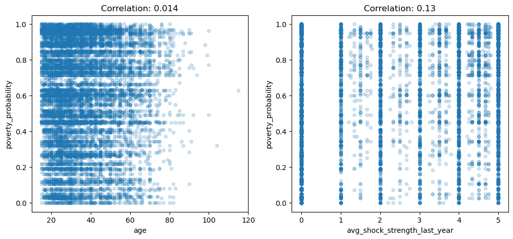
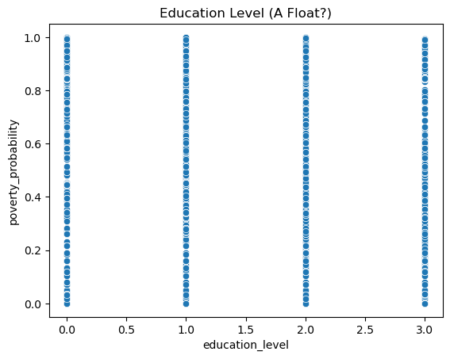
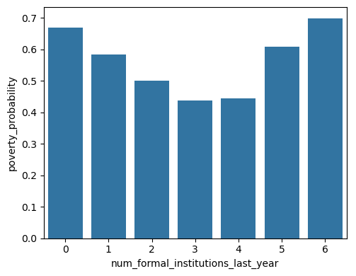

# Analyzing the Predictability of the Poverty Probability Index
This project analyzes the predictability of the Poverty Probability Index from survey data.  The [Poverty Probability Index / **PPI**](https://www.povertyindex.org/) is a measurement tool for predicting poverty on a global scale.  This project asks whether the PPI can be predicted well from general data provided by [Financial Inclusion Insights](http://finclusion.org/) for individuals.

## Models Deployed
The best model found was a boosted decision tree regressor in Azure Macine Learning Studio.  Predictive accuracy was still limited; only a low R-squared score of 0.422 was achieved.  More standard machine-learning models were tried:
- Linear regression
- Standard decision tree regressor
- AdaBoost

The result was that *standard linear regression* was the most accurate, at R-squared=0.359.

## Predictive Power
Predictive power of the data was quite limited.  I investigate this problem point to two issues in the data:
1. The target is a continuous variable, but the data are almost wholly categorical.
2. The individual features are highly probabilistically independent of the target, limiting the real predictive power of the dataset.

Analysis of the features showed important issues.  The only real continuous numeric values had almost no correlation with the target.

Some features were categorized as floats, but were really integers:

 

The most interesting feature was significantly informative on the target, but had *no correlation.*

I use a simple measure of "prediction range," a basic separability metric, to evaluate the features on the target.  For categorical feature variable `x` that ranges over groups `g`:

prediction range = `max_g E[y|x=g] - min_g E[y|x=g]`

The mean range was 0.11 on the probability index, representing 11 percentage points.  This simple metric showed that many features had almost predictive power on the target.  

It was stunning to see the variables that made almost no difference to expected PPI on this measure.  Some basic math skills, and features that would appear to be direct indicators, had almost no effect.  (Note ranges are effectively absolute values, do not indicate direction.)

|Feature|Range|
|---|---:|
|can divide|0.03|
|can calc compounding|0.02|
|borrowed for emergency last year|0.02|
|employed last year|0.03|

Other features were quite significant, but were plausibly effects of poverty, not causes.  
|Feature|Range|
|---|---:|
| num financial activities last year|0.37 |
| phone technology|0.28 |

Demographics were mixed in effect.  Gender was not significant, but religion was.
|Feature|Range|
|---|---:|
| female|0.03 |
| religion|0.24 |

## Summary
Ultimately, this project shows weak predictive power of the available survey data for predicting the Poverty Probability Index.  Multiple predictive models were tried with weak results.  Analysis of feature prediction ranges helps explain this limited predictive power.

Yet negative results can be informative.  The failure of certain features to predict the PPI represents an avenue for research in its own right.  Why certain financial activities or math skills have almost nothing to do with PPI is an interesting question in itself.

## Contents
**[Executive Report: Predicting the PPI](PPI_data_report.pdf)** - Full report of the project and findings.

**[Analytical Jupyter Notebook](Predicting-the-PPI.ipynb)** - Walks through the evaluation of predictive power; deploys the ML models.  
